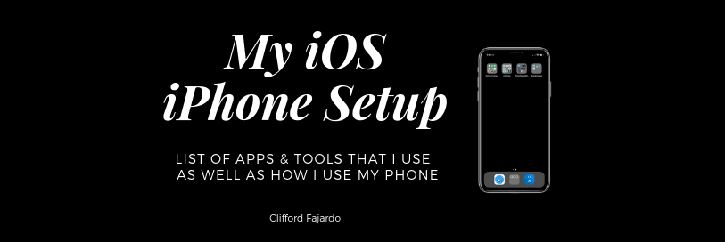

# Clifford Fajardo's iOS Setup
> An overview of how I organize my iPhone in a minimalist style and how I generally use it. Apps & toosl includes.

## Table of Contents
- [Philosphy](#philosphy)
- [How I Organize My Phone](#how-i-organize-my-phone)
    - [My Applications](#my-applications)
    - [My Social Media Apps](#my-social-media-apps)
    - [Settings](#settings)
- [Resources](#resources)
- [Related](#related)
  - [My Knowledge Wiki](#related)
- [Thank You](#thank-you)

## Philosphy
I view my phone as a tool and not so much as an entertainment device. I intentionally consume my entertainment on my desktop or laptop only.

## How I Organize My Phone

#### My Applications
These are the apps I've downloaded off the app store that I most frequently use.
I have few apps like Zoom, my bank app, airbnb, lyft venmo that I use once a month, but I decided not to list those 1 off apps which I have very few of.

- Google Apps
  - Google Drive
  - Google Calendar
  - Google Maps
  - Google Photos - *I use this to backup all my photos as I taken them*
  - Google Fi - *I manage my phone service with Google here*
- 1Password - *a password manager for forgetful people like me.*
- Adblock X - *adblocker for Safari. Mostly use it to speed up web pages by blocking ads from loading.*
- DayOne - *the app I use for journaling almost everyday.* I've used it for nearly 5 years. It has an export to PDF option which is nice
- Nofeed - block out newsfeeds from Facebook, Twitter, Instagram. It's a safeguard so I don't waste time. If I do really need to see a newsfeed I turn if off.
- Mixcam - dual camera for my iPhone
- Messenger - *I use this over facebook.com for checking my messages to avoid distractions*
- Spotify - *my music service*
- My Fitness Pal - *Food tracker that allows me to simply scan the label on the food you eat and that's it!*
- Multitimer app - I create timers with this app.
- Liberate - *a distraction blocker.*
- Notion - *similar to Google Drive, but much more flexible, customizable and amazing!*
- Slack - *keep up to date with my close friends*
- Yelp - *food reviews when I'm on the go*

#### My Social Media Apps
I don't keep social media apps on my phone. I only download them when I'm traveling or going to a social event.
If prefer to check my social media on my desktop computer, but if I need to check it on mobile, I'll just use the web version.

Why not just keep the app on your phone?
- I use social media intentionally and don't like to stay on there too long.
  - Ever wasted time scrolling down your newsfeed?
- Removing the app from my phone means it requires me to take extra steps before using the app and think why I want to use it.

#### Settings
- Grayscale: I use my iPhone 99% of the time on Grayscale mode. This great at reducing distractions since colors don't stand out.
- Safari
  - Absolutely blank tabs. This is to avoid unconscious browsing. I don't want my phone suggesting searches or triggering thoughts. To achieve this the following were turned off in safar settings:
    - no bookmarks (all were deleted)
    - no favorites (all were deleted)
    - siri suggestions turned off
- Notifications for all apps are off except:
  - Calendar
  - Messages
- Display Settings
  - I have Night Shift enabled from 6pm - 7am. This reduces the white light emmited the iPhone screen. At night white light from our phones has the effect of often killing our urge to sleep.

## Resources
- [Deep Work by Cal Newport](https://gist.github.com/cliffordfajardo/0c2ce010a52eb1056bf23031b7185070) was one of the books that changed my life for the better.
- [Humanetech](https://humanetech.com/)
- [How to Setup your iPhone for Productivity Focus and Your Own Longevity](https://medium.com/better-humans/how-to-set-up-your-iphone-for-productivity-focus-and-your-own-longevity-bb27a68cc3d8#9076)

## Related
- [My Knowledge Wiki](https://github.com/cliffordfajardo/my-knowledge-wiki) - where I list other setups, resources and links that are important to me.

## Thank You
> Thanks for reading! I'm mostly hang out on [twitter](https://twitter.com/cliffordfajard0), let's talk!

